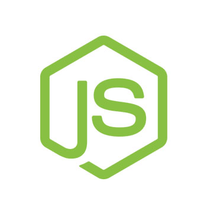

## Node

**Author**: Matheus Cesário <[matheus.cesario.santos@gmail.com](mailto:matheus.cesario.santos@gmail.com)>
**Description**: Baby steps into Node world


## Table of contents
1. [Getting started](#getting-started)


## Getting started
Download:

* [Windows x64](https://nodejs.org/dist/v4.1.2/node-v4.1.2-x64.msi)
* [Macintosh](https://nodejs.org/dist/v4.1.2/node-v4.1.2.pkg)
* [Linux x64](https://nodejs.org/dist/v4.1.2/node-v4.1.2-linux-x64.tar.gz)

For Ubuntu distro:
```bash
# Downloading node
sudo apt-get update
sudo apt-get nodejs

# Creating and symlink so we can use the usual command `node`
sudo ln -s /usr/bin/nodejs /usr/bin/node
```


## Programs

### Hello world
Say hello to your new favourite backend language!

### Closures
Understand closures is essential to learn Node. Thanks to this strategy, we can manage threads without blocking the server, dramatically increasing the amount of simultaneous requests and memory usage!

### Modules
In Node we can expose our objects using the command `exports`. Then we can take advantage of it and include the file into our project using `require()`. This way we can build better apps by structuring the project and dividing into different modules.

### Reading file
Since we are in the server side now, we can use several cool features like the File System module, that let us read files from our folders!

### Reading parameters from terminal
Getting parameters from terminal and performing requests!


## References
* [Beginning Node.js](http://www.amazon.com/Beginning-Node-js-Basarat-Ali-Syed/dp/1484201884)
* [Convincing the boss guide](http://nodeguide.com/convincing_the_boss.html)
* [#NodeJs Stackoverflow](http://stackoverflow.com/questions/tagged/node.js)
* [Learn You The Node.js For Much Win!](https://github.com/workshopper/learnyounode)
* [MEAN Web Development](https://www.packtpub.com/web-development/mean-web-development)
* [Node docs](https://nodejs.org/api/)
* [Node School](http://nodeschool.io)
* [Node in Action](https://www.manning.com/books/node-js-in-action)
* [Why The Hell Would I Use Node.js? A Case-by-Case Tutorial](http://www.toptal.com/nodejs/why-the-hell-would-i-use-node-js)

